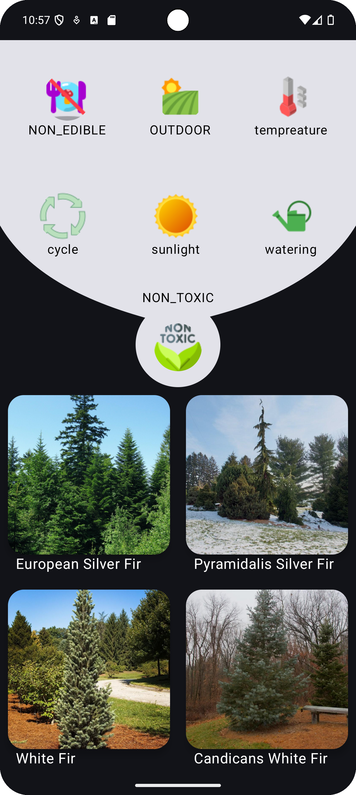

# Plantoniam

   ## Main Features
   - Filter Chips
   - Range Slider
   - Bottom Bar
   - page Counter

   ## Example
   |                                            |                                               |
   |:------------------------------------------:|:----------------------------------------------|
   |    |      |
   |  |       |
   |   |  |

 ## Architecture 
  - MVVM Architecture (Model - ComposableView - ViewModel)
  - Repository pattern
  - Hilt - dependency injection

## Built With 🛠
- [Kotlin](https://kotlinlang.org/) - First class and official programming language for Android development.
- [Jetpack Compose](https://developer.android.com/jetpack/compose) - Jetpack Compose is Android’s modern toolkit for building native UI.
- [Coroutines](https://kotlinlang.org/docs/reference/coroutines-overview.html) - For asynchronous and more..
- [Dependency Injection](https://developer.android.com/training/dependency-injection)
  - [Hilt](https://dagger.dev/hilt) - Easier way to incorporate Dagger DI into Android apps.
- [ktor](https://ktor.io/docs/client-engines.html) - Light weight based on kotlin.
